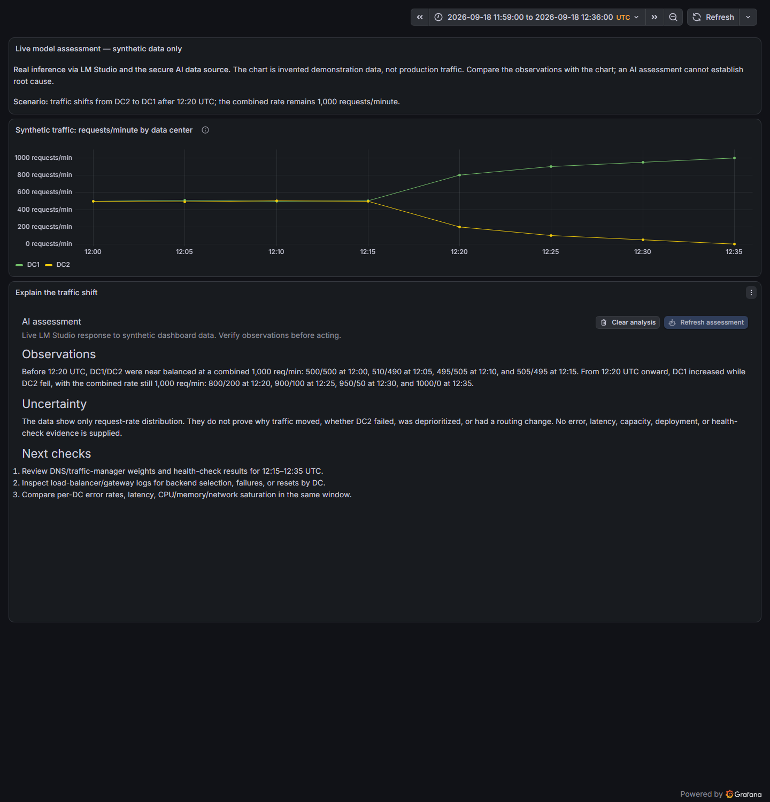
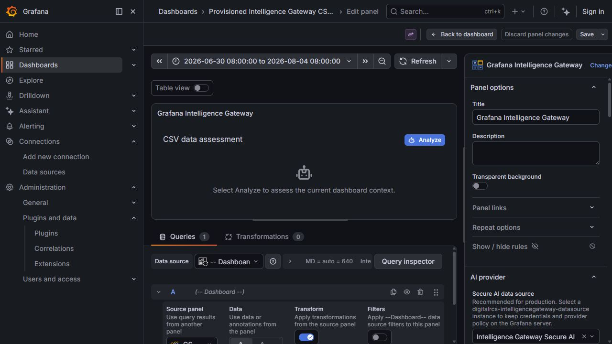

# Intelligence Gateway Secure AI data source

This DigitalRCS backend data-source plugin is the secure provider boundary for the companion
`digitalrcs-intelligencegateway-panel`. Grafana encrypts provider credentials stored in `secureJsonData`; only the Go
backend decrypts and adds them to provider requests. Dashboards and browser code never receive a credential.

Plugin ID: `digitalrcs-intelligencegateway-datasource`  
Grafana: `>=11.6.0`

Read the [catalog overview](src/README.md) for product capabilities, requirements, and the first-panel workflow. The catalog README is maintained in `src/README.md` and packaged as `dist/README.md`; this root README covers implementation and development.

Install this data source **alongside**, not inside, the [Grafana Intelligence Gateway panel](https://github.com/digitalrcs/grafana-intelligence-gateway). Both belong to the same Grafana installation, and the configured instance must be in the dashboard's organization. See [Installation and Quick Start](wiki/Installation-and-Quick-Start.md) for exact directory placement and [catalog integration](docs/CATALOG_INTEGRATION.md) for packaging and dependency details.



The [GitHub Wiki](https://github.com/digitalrcs/grafana-intelligence-gateway-datasource/wiki) contains the complete installation, configuration, security, panel-integration, review, and troubleshooting guides.

## What this enables

Operators can use an administrator-configured model to summarize selected dashboard data, draft incident handovers, or suggest verification steps. The companion panel gathers Grafana query results and displays the assessment; this data source provides server-side provider access, credentials, and shared request limits. It can also return an answer DataFrame for a supplied prompt through its query editor. It does not collect metrics independently or establish root cause.

The credential-free Docker demo uses a **fixed mock receipt, not AI inference**. Follow the [worked traffic-shift example](https://github.com/digitalrcs/grafana-intelligence-gateway/wiki/Reviewer-Walkthrough) for the purpose, synthetic inputs, real-provider setup, and captured assessment.

## Configuration contract

Non-secret `jsonData`:

```json
{
  "provider": "openai",
  "baseUrl": "https://api.openai.com/v1",
  "defaultModel": "gpt-4.1-mini",
  "timeoutSeconds": 300,
  "allowedModels": ["gpt-4.1-mini", "gpt-4.1"],
  "maxOutputTokens": 256000,
  "allowInsecureHttp": false
}
```

Write-only `secureJsonData` supports `apiKey` and `bearerToken`. A bearer token takes precedence over an API key.
OAuth client-credentials exchange and streaming are not supported. Legacy `clientSecret` and `allowStreaming`
configuration values are ignored; remove unused client secrets through provisioning or Grafana's data-source API.

An empty `allowedModels` permits only `defaultModel`. A nonempty list must include the default model. When upgrading
from 1.0.0, explicitly list any additional models your panels use before saving the configuration.

The included provisioning example reads `OPENAI_API_KEY` from the Grafana server/container environment. Never commit a
real key or put one in dashboard JSON.

## Backend API

The panel can access these data-source resources through Grafana's authenticated data-source resource API:

- `GET /models` returns only administrator-permitted model IDs, without provider-specific metadata.
- `POST /chat/completions` and `POST /analyze` accept a bounded gateway request and return the provider's
  OpenAI-compatible response.

Example request body:

```json
{
  "prompt": {
    "system": "You are a careful observability analyst.",
    "user": "Assess the supplied dashboard data."
  },
  "model": "gpt-4.1-mini",
  "temperature": 0.2,
  "maxOutputTokens": 1200,
  "stream": false
}
```

The effective output cap is `min(request.maxOutputTokens, jsonData.maxOutputTokens)`. If the request omits a cap, the
administrator ceiling is still sent to the provider. The ordinary data-source query editor exposes the same basic
request and returns a one-row `answer` frame, while the companion panel should use the resource API directly.

## Security policy

- Provider URLs are administrator-controlled and resource paths are fixed; dashboard requests cannot choose a host or
  arbitrary upstream path.
- HTTPS is required by default. An administrator may explicitly enable **Allow insecure HTTP** (`allowInsecureHttp`) for
  organizational networks whose hostnames or addresses cannot be classified reliably. This override permits HTTP
  without hostname locality checks and can expose credentials and prompts in transit; use network controls accordingly.
- OpenAI remains restricted to `api.openai.com` even when the HTTP override is enabled.
- Redirects are rejected. Link-local, multicast, and unspecified destinations are rejected.
- Request bodies are capped at 1 MiB and provider responses at 16 MiB.
- Each data-source instance permits four concurrent calls and 30 calls per minute. Provider/model-specific budget and
  organization billing limits should remain enabled as the authoritative cost control.
- Provider response bodies are never included in error messages. Prompts, responses, and credentials are not logged.
- Only `system`, `user`, and `assistant` message roles are accepted. The configured model allow-list and token ceiling are
  enforced server-side.

Grafana data-source permissions should restrict who may edit and query this instance. Review egress/firewall rules as a
second SSRF boundary.

## Development

Requirements: Node.js 22+, npm, Go version from `go.mod`, Mage, Docker, and Docker Compose. Grafana's scaffold tooling is
supported on Windows through WSL.

```bash
npm install
npm run typecheck
npm run lint
npm run test:ci
npm run build
mage -v test
mage -v build:linux
npm run package:plugin
docker compose up
```

Use `npm run package:plugin` instead of Windows `Compress-Archive`: it preserves the Linux backend binary's required
`0755` executable mode and the explicit top-level plugin directory in the ZIP. The filename comes from the built
`dist/plugin.json` ID and version; missing required catalog files, referenced images, or backend binaries fail before
an archive is created. Test the helper with `python -B -m unittest discover -s scripts -p test_package_plugin.py`.

Open <http://localhost:3000> and sign in with `admin` / `admin`. The development stack provisions a deterministic mock
provider, the data source, and a review dashboard; it requires no external credential. Use **Save & test**, then open
**Dashboards > Intelligence Gateway Data Source Review** and run the sample query. The health check calls the provider's
`/models` route so it verifies network access without sending a prompt.

Restart Grafana after changing `src/plugin.json`. The generated GitHub Actions workflows build the frontend and backend,
run tests, package a ZIP with the required top-level plugin directory, and sign when
`GRAFANA_ACCESS_POLICY_TOKEN` is configured.

If port 3000 is already in use, set `GRAFANA_PORT` before starting Compose (for example, `GRAFANA_PORT=3002`).

## Panel integration

In the companion panel, select this instance under **AI provider > Secure AI data source**. The panel stores this
data-source UID plus non-secret model, temperature, and output choices. **Load models securely** uses the `/models`
resource, and **Analyze** posts the constructed prompt to `/chat/completions`. The current panel uses this server-side
connection with buffered responses; it has no direct provider credential fields. Keep the panel's **Queries** connection
pointed at the data to analyze, and choose this AI connection separately under **AI provider**.



## Integrated Docker test

When both repositories are sibling directories, the panel repository's `docker-compose.yaml` mounts both `dist`
directories and provisions this data source with UID `intelligence-gateway-secure`. Build this frontend and Linux backend,
build the panel, and run `docker compose up --build` from the panel repository. Open <http://localhost:3004> and use
**Intelligence Gateway: traffic-shift walkthrough**. The default mock needs no provider credential and performs no
inference. Follow the [real-provider walkthrough](https://github.com/digitalrcs/grafana-intelligence-gateway/wiki/Reviewer-Walkthrough)
to configure a separate instance for an actual assessment.

## License

Apache-2.0. Copyright 2026 DigitalRCS.
